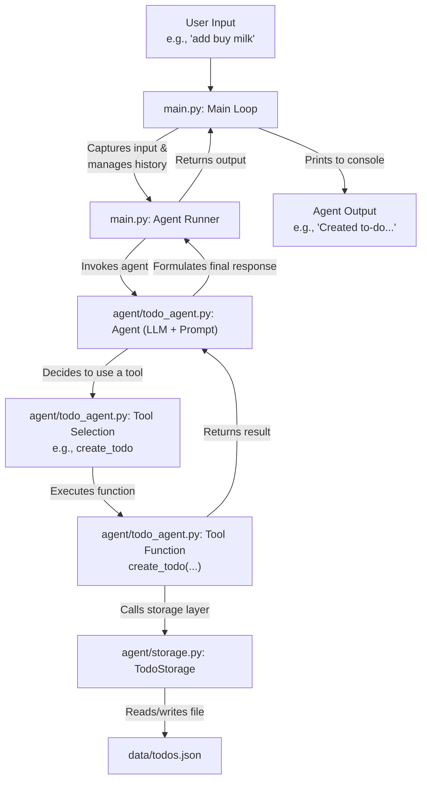

```mermaid
graph TD;
    UserInput["User Input<br/>e.g., 'add buy milk'"] --> MainLoop["main.py: Main Loop"];
    MainLoop -- "Captures input &<br/>manages history" --> Runner["main.py: Agent Runner"];
    Runner -- "Invokes agent" --> Agent["agent/todo_agent.py: Agent (LLM + Prompt)"];
    Agent -- "Decides to use a tool" --> ToolSelection["agent/todo_agent.py: Tool Selection<br/>e.g., create_todo"];
    ToolSelection -- "Executes function" --> ToolFunction["agent/todo_agent.py: Tool Function<br/>create_todo(...)"];
    ToolFunction -- "Calls storage layer" --> Storage["agent/storage.py: TodoStorage"];
    Storage -- "Reads/writes file" --> Data["data/todos.json"];
    ToolFunction -- "Returns result" --> Agent;
    Agent -- "Formulates final response" --> Runner;
    Runner -- "Returns output" --> MainLoop;
    MainLoop -- "Prints to console" --> AgentOutput["Agent Output<br/>e.g., 'Created to-do...'"];
```
