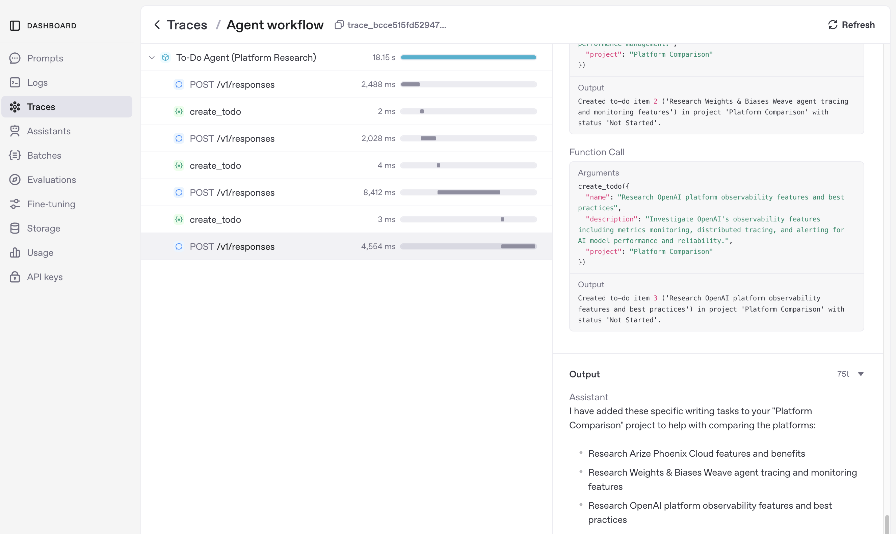
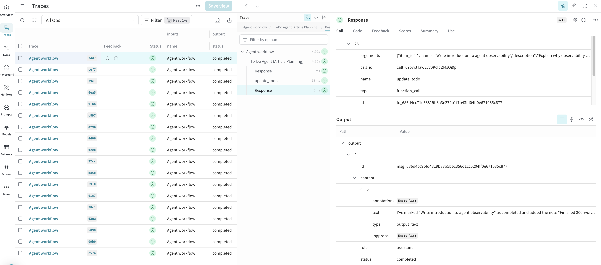

# Observability for Foundation Models: A Practical Tool Comparison

Hey fellow MLOps practitioners, as we increasingly rely on foundation models, we're giving up direct control over training and fine-tuning. This means our evals have to work harder: the same prompt can drift in performance with model updates, and swapping from a large model to a smaller one (or even between providers) can introduce unexpected changes.

This creates a real evaluation gap. Basic metrics like cost, latency, and success/failure are a solid start, but to ensure consistent performance, we need to dive into traces and spans. They help us build robust evals, spot patterns across datasets, and measure things like intent accuracy or tool selection quality—no matter how the underlying model evolves.

I've been experimenting with three observability platforms—OpenAI's native tracing, Arize Phoenix, and W&B Weave—using a simple multi-tool agent as my test case. In this post, I'll share what I learned: how each platform handles traces, their unique strengths, and when to use them in your MLOps pipeline. Let's bridge that eval gap together—what do you say?

---

## Part 1: Test Case - Multi-Tool Agent Architecture

I built this simple CRUD to-do agent to mimic the kind of multi-tool workflows we see in production—like an overworked intern juggling database ops and quick web searches. It's powered by `gpt-4.1-mini`, with a detailed prompt for reasoning, tools for task management, and persistent storage.

### Quick-Start: Run the Agent

Get it running locally in minutes:

```bash
git clone https://github.com/your-repo/todo-agent.git
cd todo-agent
uv sync  # Install deps with uv
cp .env.example .env  # Add your API keys
uv run main.py
```

Now you're ready to test commands like 'Add a task to research MLOps tools.'

### Why This Makes a Good Eval Test Case

This agent combines LLM reasoning, tool selection, and multi-step execution—perfect for evaluating things like intent classification accuracy or workflow coherence. In production terms, it's like a lightweight RAG system: vague user input → tool calls → refined output.

### Core Components

- **Model**: `gpt-4o-mini` for cost-effective intelligence.
- **Prompt**: Guides proactive task management.
- **Tools**:
  - `create_todo`: Add tasks.
  - `read_todos`: List or filter tasks.
  - `update_todo`: Modify tasks (e.g., mark complete).
  - `delete_todo`: Remove tasks.
  - `web_search`: Research to clarify vague requests.

### Execution Flow

The agent interprets your request, selects tools, executes them, and responds—mirroring real MLOps pipelines where drift can hit any step.

---

## Part 2: Traces & Spans: The Building Blocks

In traditional ML, we relied on validation sets and metrics like F1-score to catch issues before prod. With foundation models, traces fill that role—they're like detailed logs of your AI's decision-making process, helping us evaluate performance without retraining.

### What is a Trace?

A trace is the full execution record of a single workflow, documenting every step from input to output. Think of it as your AI's 'flight recorder'—essential for post-mortems when things drift.

### Breaking It Down: Spans

Each trace consists of spans, which are isolated steps in the process. For our agent, a typical trace might include:
1. **Input Processing**: The LLM interprets the user's request.
2. **Tool Selection & Execution**: Calling tools like `web_search` or `update_todo`.
3. **Output Generation**: Formulating the final response.

### Key Metadata for Evaluation

Every span includes metrics that bridge the eval gap:
- **Latency**: Time per step (in ms)—crucial for spotting bottlenecks during model swaps.
- **Tokens**: Usage and cost—helps compare large vs. small models.
- **Input/Output**: Exact data flowing through—perfect for semantic analysis.
- **Status**: Success or error—basic but expandable for custom evals.

By aggregating these across traces, we can make data-driven decisions: tweak prompts if intent classification fails often, or switch models if latency spikes.

### Practical Eval Example: Analyzing Tool Selection Accuracy

Here's how I use spans to evaluate if the agent picks the right tool:

```python
# Pseudocode: Analyzing spans from exported traces (adapt for your platform)
import json

def evaluate_tool_accuracy(trace_data: list[dict]) -> float:
    correct_selections = 0
    total_spans = 0
    for trace in trace_data:
        for span in trace['spans']:
            if span['type'] == 'tool_call':
                total_spans += 1
                # Custom logic: Check if tool matches expected for input
                if is_correct_tool(span['input'], span['tool_name']):
                    correct_selections += 1
    return correct_selections / total_spans if total_spans > 0 else 0.0

# Usage
traces = json.load(open('exported_traces.json'))
accuracy = evaluate_tool_accuracy(traces)
print(f'Tool selection accuracy: {accuracy:.2%}')
```

This kind of analysis helped me spot when prompt tweaks improved accuracy from 75% to 92% after a model update. What's your go-to eval metric here?

---

## Part 3: Platform Comparison - What I Learned

To put these platforms to the test, I ran the agent's built-in demos—things like article planning and web research—that simulate real MLOps workflows. Here's what stood out when I dug into the traces: each tool has its place depending on your pipeline stage and team needs.

### Quick Intro to the Platforms

- **OpenAI Native Tracing**: Built-in and zero-fuss, like the default dashboard you reach for quick checks.
- **Arize Phoenix**: Analytics-heavy for deep dives, great for spotting patterns in large trace sets.
- **W&B Weave**: Experiment-focused with collaboration features, ideal for team reviews and A/B testing.

### User Experience at a Glance

| Platform      | Dashboard Style                                          | Unique Strength                                                                                                    |
| :------------ | :------------------------------------------------------- | :----------------------------------------------------------------------------------------------------------------- |
| **OpenAI**    | **Clean & Basic**. Integrated directly into the platform. | **Simplicity & Zero Setup**. The fastest way to get basic measurements. It just works.                               |
| **Phoenix**   | **Data-Dense & Analytical**. Packed with charts for experts. | **Deep-Dive Diagnostics**. Best for hands-on debugging and custom analytics during development.                    |
| **W&B Weave** | **Polished & Professional**. A modern MLOps suite.         | **Rigorous Experiment Tracking**. Best for systematically tracking quality over time and comparing model versions. |

### How They Handle Traces

Each platform visualizes traces a bit differently, which affects how you build evals:

| Platform      | Visualization Style                                                                                              |
| :------------ | :---------------------------------------------------------------------------------------------------------------- |
| **OpenAI**    | A simple, chronological log of spans. Easy to read but less visual.                                   |
| **Phoenix**   | A waterfall chart showing span flow and timings—great for latency analysis.      |
| **W&B Weave** | A hierarchical waterfall/tree view. Shines for complex, nested workflows. |

### Hands-On Breakdown

With tracing enabled, I inspected workflows across platforms. Here's the scoop on their fits in an MLOps pipeline:

#### OpenAI Platform
- **Strengths:** Clean UI for quick filtering. Tool calls are super readable—perfect for initial integration testing.
- **Metadata:** Latency, cost, usage, tool details. Solid filtering, no heavy project management.
- **Parent/Child Structure:** Clickable traces show tool sequences clearly.
- **MLOps Fit:** Early dev and pre-prod validation. If you're iterating prompts solo, this is your quick-win tool. Low overhead means it's great for catching drift during model swaps without extra setup.


*OpenAI Platform: Clean trace breakdown with tool calls and metadata.*

#### Arize Phoenix
- **Strengths:** Detailed spans and sessions with parent/child views. Latency/tokens/cost jump out.
- **Metadata:** Workflow name, timings, tokens, cost—drill into spans for evals.
- **Parent/Child Structure:** Waterfall view highlights bottlenecks in workflows.
- **MLOps Fit:** Development debugging and analytics. When you're analyzing failure patterns across a dataset (e.g., after a provider update), Phoenix's charts help quantify eval metrics like accuracy drift.


*Arize Phoenix: Waterfall view showing parent/child spans and performance metrics.*

#### W&B Weave
- **Strengths:** Trace trees with feedback/annotation. Complex UI but powerful for teams.
- **Metadata:** Inputs/outputs, status, comments—built for collaborative evals.
- **Parent/Child Structure:** Tree view tracks flow from workflow to sub-calls.
- **MLOps Fit:** Production monitoring and experiments. Ideal for enterprise teams doing A/B tests on model versions or tracking long-term quality—share traces for reviews without screenshots.


*W&B Weave: Trace tree with feedback and collaborative features.*

| Platform   | Parent/Child Spans | Key Metadata Shown        | Collaboration | UI Style         |
|------------|--------------------|---------------------------|---------------|------------------|
| OpenAI     | Yes                | Latency, cost, tool calls | No            | Clean, simple    |
| Phoenix    | Yes                | Latency, tokens, cost     | No            | Analytical, deep |
| W&B Weave  | Yes                | Inputs, outputs, feedback | Yes           | Data science     |

**Core Metadata Across All:** Workflow details, timings, tokens, cost, tool calls, status. All support drilling down for debugging.

**My Take:** OpenAI for speed, Phoenix for analysis, Weave for scale. What's been your experience mixing these in pipelines?

---

## Part 4: When to Use What - Practical Recommendations

Based on my experiments, here's my take on fitting these platforms into your MLOps workflow. I'll break it down by stage, with honest pros/cons—because let's face it, no tool is perfect, and trade-offs are part of the game.

### Development Stage: Rapid Iteration and Debugging
- **Recommended: Arize Phoenix**
  - **Pros:** Deep analytics and customizable charts make it easy to spot eval issues like prompt drift early. Great for solo devs analyzing span patterns.
  - **Cons:** Can feel overwhelming if you're not into heavy data viz—setup takes a few extra lines.
  - **Scenario:** You're tweaking prompts after a model update and need to quantify accuracy drops. Phoenix's waterfalls helped me debug a 15% intent failure rate in under an hour.
  - **Trade-off:** More powerful for complex evals, but if your team's small, the learning curve might slow you down.

### Pre-Production: Validation and Benchmarking
- **Recommended: OpenAI Platform**
  - **Pros:** Zero setup and integrated with your model provider—jump straight to traces without config hassle.
  - **Cons:** Lacks advanced collaboration; it's more for quick checks than team reviews.
  - **Scenario:** Testing a swap from GPT-4 to a smaller model? Use it to benchmark latency and cost across traces—saved me from a bad switch that would've spiked tokens by 40%.
  - **Trade-off:** Super simple for individuals, but if you need to share insights, you'll be screenshotting a lot.

### Production: Monitoring and Collaboration
- **Recommended: W&B Weave**
  - **Pros:** Built-in feedback and experiment tracking—perfect for teams doing A/B tests or long-term monitoring.
  - **Cons:** Steeper setup and UI complexity; overkill for tiny projects.
  - **Scenario:** In a scale-up team, use it to track eval metrics over weeks, catching drift from provider updates. Weave's trees made collaborative reviews a breeze in my last project.
  - **Trade-off:** Enterprise-ready with great scalability, but don't bother if you're not collaborating—stick to lighter options.

Don't get me wrong, you can mix and match (I often start with OpenAI and layer on Phoenix for deeper dives). Consider your team size: solo? Go simple. Enterprise? Invest in Weave. Budget tight? All have free tiers to test. What's your stack look like—any hybrid setups working well?

---

## Conclusion: Why This Matters

Observability is not just about finding errors; it's about understanding and improving your AI. By using these tracing toolkits and their dashboards, you move from guesswork to data-driven management. Each platform offers a unique perspective on your agent’s workflow, letting you choose the right tool for your needs.

Key takeaways from this process:
- **Observability Over Validation**: Use tracing dashboards to evaluate agent quality, not rigid, hardcoded checks.
- **Realistic Scenarios**: Learn agent capabilities by having them perform real-world tasks.
- **Natural Language Robustness**: A well-designed agent can handle casual input, typos, and informal language gracefully.

This approach of building, measuring, and refining is the core loop of modern AI engineering. 